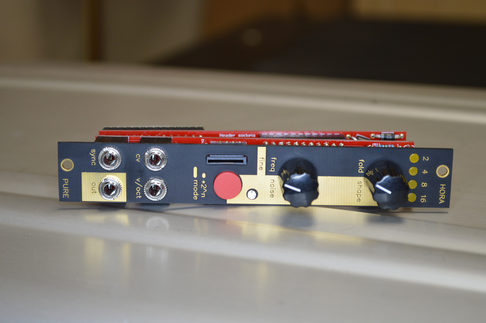

# Hora Pure Front Panel

The Hora Pure firmware for Radio Music is super fun! This repo contains the Eagle PCB files for a black+copper front panel that works well with the Pure firmware. The files are specifically made to be used with the OSH Park After Dark PCB service, and that's how the one pictured below was manufactured. If you plan to have them manufactured somewhere else, you'll probably have to verify that the layers will produce what you're expecting. OSH Park are a really excellent company and only require the Eagle brd file. You can [click here to import the BRD file directly](https://oshpark.com/import?url=https://raw.githubusercontent.com/rahji/pure_panel/main/eagle/hora_panel.brd). (Don't forget to choose the After Dark service when checking out!) You get three boards with every order, but it shouldn't be hard to find two other interested people to share with.

Have fun!

* [Hora Music Pure Complex VCO](https://www.hora-music.be/complex-vco.php)
* [OSH Park After Dark PCB Service](https://docs.oshpark.com/services/afterdark/)
* [Music Thing Modular Radio Music](https://musicthing.co.uk/pages/radio.html)
* [Black Lives Matter Eagle Library](https://github.com/rahji/blacklivesmatter-eagle-lib)

